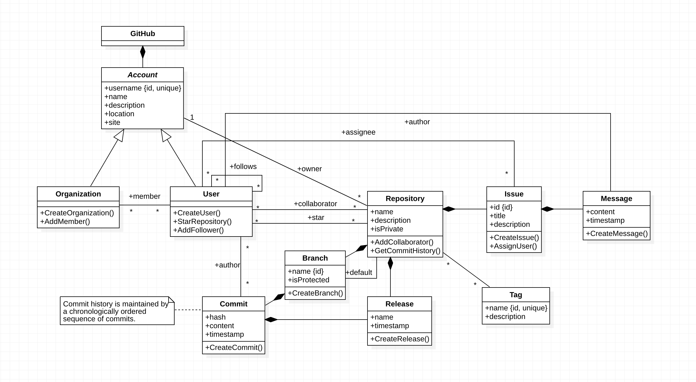
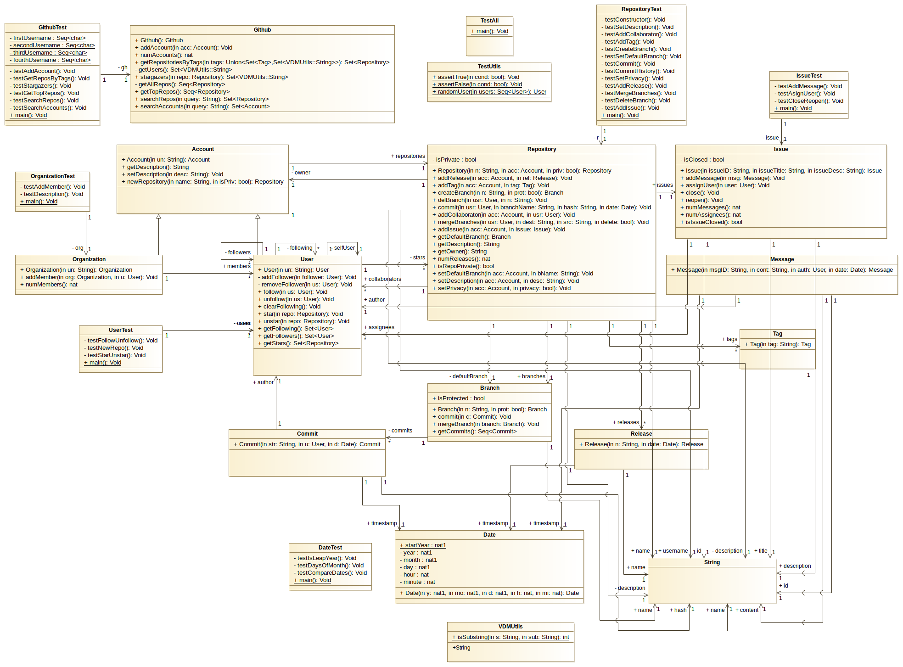

# feup-mfes

Formal modelling of 'Github' website in VDM++ using the Overture Tool.

## Report: [here](./docs/github-modelling-report.pdf)

## Original UML Class Diagram

## Generated UML Class Diagram
